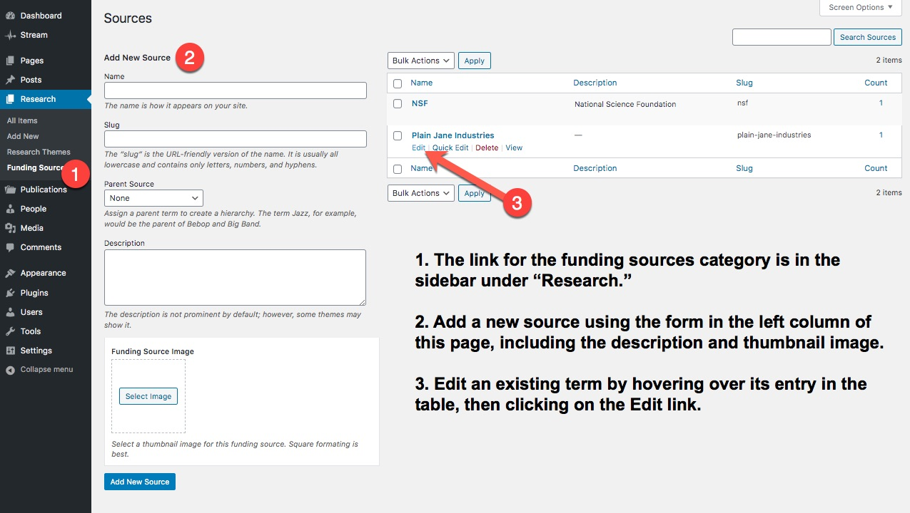

### Funding Sources

[Research projects](../research) can be assigned to a category that corresponds to the funding source for the project. You can use the same taxonomy to represent funding sources coming from both government agencies (NSF, DARPA, ADOT) or private industry sponsors. The same funding source category can be applied to multiple research projects.

Funding sources that are created "on the fly" within the post editing screen will display in the footer on the research project page. However, for the best looking results, each funding source can be enhanced with a description and a thumbnail image.

To adjust the settings for a funding source term, navigate to `/wp-admin/edit-tags.php?taxonomy=funding-source&post_type=research` and edit the terms individually. From this same screen, you can also add a new term (complete with the thumbnail and description) for use within the post editing screen.

    

### Faculty / Student Types

This taxonomy is typically used to refer to roles within a lab setting or the enrollment status of a particular student.

- **Lab Roles:** Typical terms include Principal Investigator, Lead Researcher, Project Manager, Researcher and Lab Assistant.
- **Enrollment Status:** Refers to the type of student that a person might be. Terms include Post-Doctorate, Graduate Student, Undergraduate Student, 4+1 program and others.

The terms from this taxonomy are not displayed on the individual profile page but are used to group people together within the directory page.

### Degree Program

Refers to the degree or program that a person might be enrolled in or have completed while working in this lab. Lists of [undergraduate](https://engineering.asu.edu/undergraduate-degree-programs/){:target="\_blank"} and [graduate](https://graduate.engineering.asu.edu/graduate-programs/){:target="\_blank"} degree programs can be found on the [ASU Engineering](https://engineering.asu.edu/programs/){:target="\_blank"} web site.

Please use the official degree name or description including proper abbreviation and punctuation wherever possible.

The degree program appears at the bottom of an individual profile screen immediately under the introduction (main content).

### Graduation Date

Refers to the date in which a person is expected to graduate. Typically written out as either Fall or Spring followed by a year. Example: **Fall 2021**
