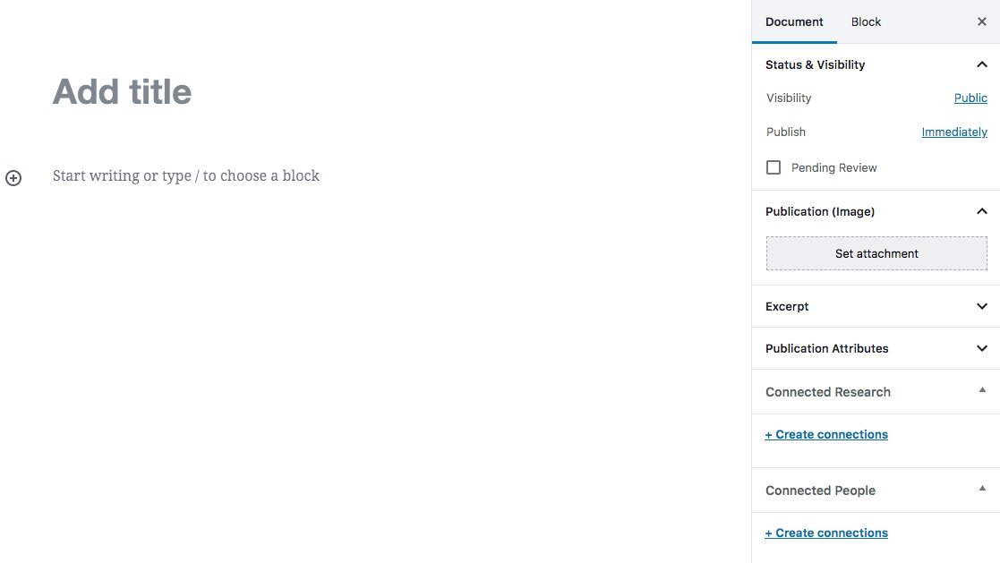
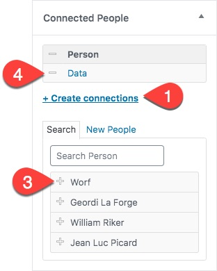
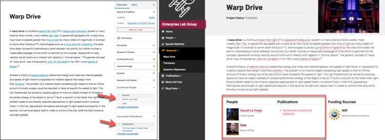

### What is a connection?

One of the most important features of the ASU Labs theme is its unique ability to keep track of the linkages between the various types of content that you can add to your website. We have built specific templates for the presentation of the people, the projects and the publications that are produced by the teams of people with whom you collaborate. With a couple of additional clicks, your website can build and maintain links within the pages of your website that clearly tell the story of the people associated with specific projects or publications.

### Connection Boxes

Creating connected content is easy. Within the content editing screen for any of the main content types (people, publications, research projects), look for the additional dropdowns toward the sidebar labeled **Connected People**, **Connected Publications** or **Connected Research**.

    
        

All connection boxes function in the same way. To establish a connection:

1. Click on the Create Connections link
1. A list of the most recently created items will appear.
1. Click on the plus sign next the the item to connect it to the item you are currently editing.
1. Clicking on the resulting minus sign will remove the connection if needed.

**There is no limit to the number of connections you may create.** Have 15 people working on your research project? No problem. Is there one ongoing research project within your group that is responsible for the publication of several journal articles? Connect them all up!
{: .info }

**You do not need to create the "reciprocal" connection.** If you build a link between your two graduate students and their assigned project, you do not need to assign the project back to the graduate students. The website maintains the linkages automatically.
{: .info }

### Displaying connected content

Once a connection between two content types has been created, the website templates will automatically create links between the connected items and display them in the footer of the appropriate template.

The example site shows a research project called Warp Drive, with an established connection between the project and the two chief engineers of the USS Enterprise: Geordi La Forge and Data. The links back to the person profile of these engineers is created automatically by adding a **connected research** assignment to each of their profiles.

The link to the affiliated publication about black hole mechanics within the example site is also created and maintained in the same way.

