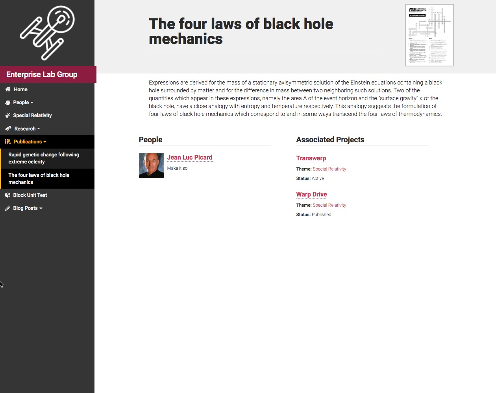

Your website can feature individual publications that are relevant to specific projects or people within your lab. These pages aren't meant to be a substitute for a complete publication list, but rather to call out published works that are of a significant interest to potential students and other researchers.

## Screenshots ##

    
    

## Organization ##

Publications can be categorized into specific research topics. To accomplish this, be sure to assign the publication page to most appropriate research topic category. Categories can be created "on the fly" within the post editor and can be edited in the [Research Topic](../research-topic.html) screen in the admin area.

### Citations ###

Be sure to include the citation in the included meta box below the page's content. The citation appears directly below the title of the page as well as in any created research topic pages. The rich-text editor can assist with any specific formatting that your citation might require (underline, bold, italics).

### Publication Date ###

**This feature is under development.** Eventually, the date of publication will allow for the additional sorting and grouping of publications in places where multiple publications are displayed.
{: .info}

### Featured Image / Downloadable File ###

Upload a PDF to make it available for download wherever the publication is linked within the website. The featured image of this page template and the downloadable file are intended to work together to highlight the publication near the page title.

Best practices for this feature are to:

- create a thumbnail image of the PDF as a JPG or PNG
- set the image as the featured image of the publication.
- upload a separate PDF document in the indicated area under the content window.

 This will result in a thumbnail image of your publication showing up near the title of the page. This thumbnail image will link to the included PDF.

{: .resp}
