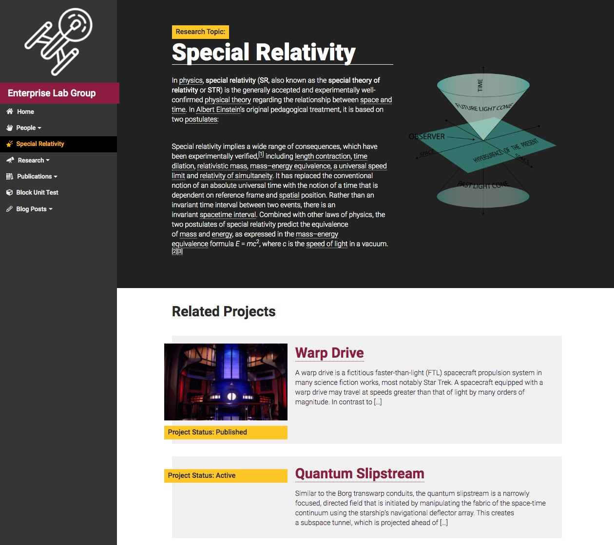
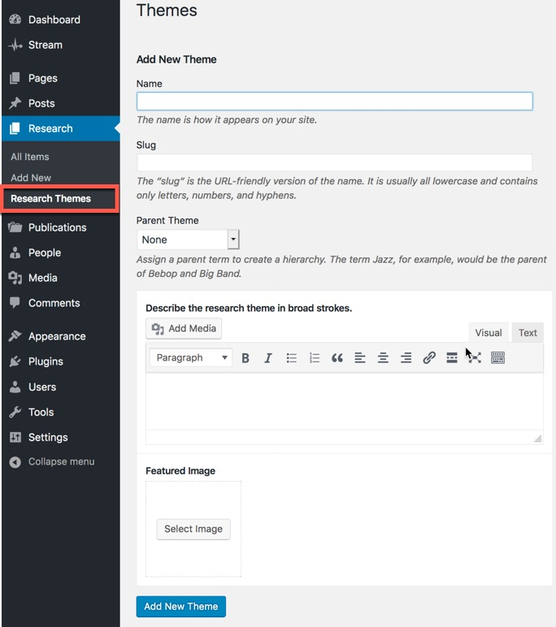
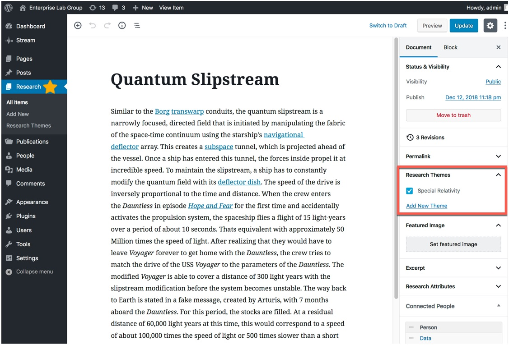
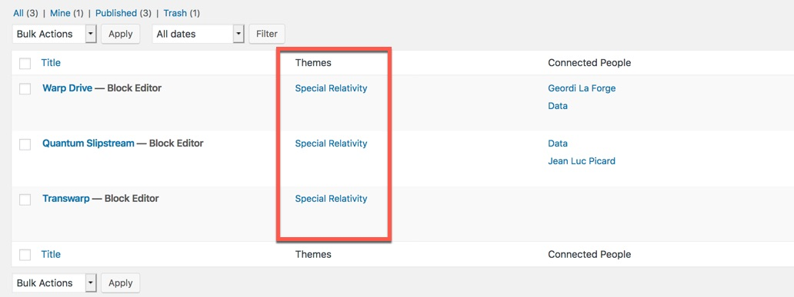

As you build individual pages describing your research projects, consider creating a "research theme" page, which introduces the subject area of your lab to a lay-person.

## Screenshots

    
    
    
        

## Organization

Research theme pages are created automatically whenever a category is created in the normal page editor. They can also be created individually within the admin menu at `/wp-admin/edit-tags.php?taxonomy=research-theme`.

You can include a research theme page within the site's main navigation by using the standard WordPress menu interface, either at `/wp-admin/menus.php` or within the customizer at `/wp-admin/customize.php`

## Description / Featured Image

Each research theme can be accompanied by a small description and a featured image. Edit the term in the taxonomy settings page to expose the additional content areas.

## Connections

Research themes are terms that can group research project and publication pages together. Whenever you associate a research project or an individual publication with a research theme term, the associated project or publication shows up on the bottom of the theme page automatically.
