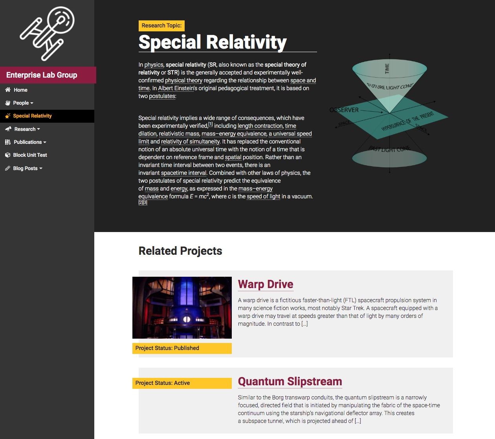
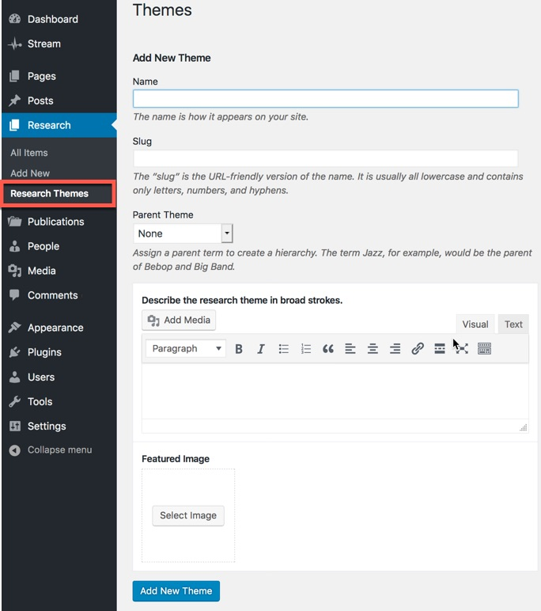
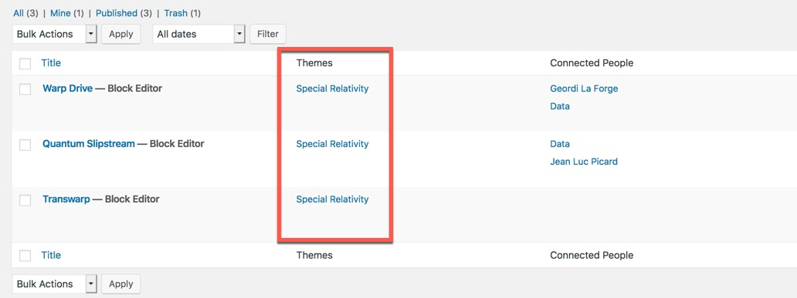

As you build individual pages describing your research projects, consider creating a "research topic" page, which introduces the subject area of your lab to a lay-person.

## Screenshots ##

    
    
    
        

## Organization ##

Research topic pages are created automatically whenever a topic is created in the normal page editor. Also be created individually within the admin menu at `/wp-admin/edit-tags.php?taxonomy=research-theme`. 

You can include a research topic page within the site's main navigation by using the standard WordPress menu interface, either at `/wp-admin/menus.php` or within the customizer at `/wp-admin/customize.php`

## Description / Featured Image ##

Each research topic can be accompanied by a small description and a featured image. Edit the term in the taxonomy settings page to expose the additional content areas.

## Connections ##

Research topics are terms that can group research project and publication pages together. Whenever you associate a research project or an individual publication with a research topic term, the associated project or publication shows up on the bottom of the topic page automatically.
