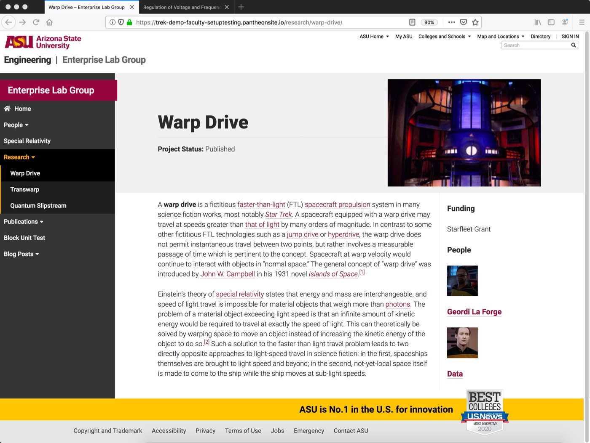
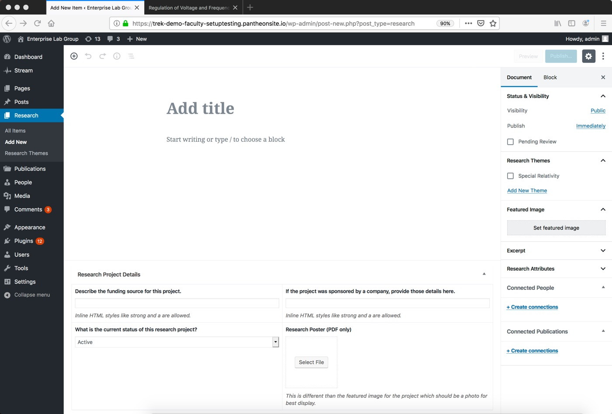
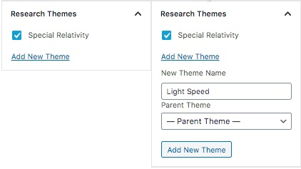
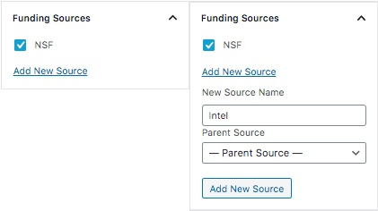

It is easy to quickly create a series of pages that focus on the active and completed research projects that are worked on by members of your lab.

## Screenshots

    
    

## Minimum Information Needed

Each research project should at a minimum contain a title and a 2-3 sentence description of the project. The project status also needs to be set via the dropdown box in the post meta area. (The default choice for a project is "active.")

## Completed Research Project

In addition to the basics described above, a fully completed research project tends to leverage the page editor's various content blocks to create a full description. The more intensional you are with content creation for these pages, the greater the chance that someone has of conducting an internet search for similar ideas. Consider including several sections in your description such as:

- the working hypothesis for the project
- a representation of the data collected
- links to proper data sets
- other research materials relevant to the discussion

Information about the project's funding or sponsorship can be included on the page by filling out the post details section below the main content window. These areas of the template were designed to be flexible and to accept custom HTML if needed.

Including a featured image for the project also will be helpful. Be sure that the chosen featured image doesn't include text captured within the image itself. (It'll be too small to see when the image is presented in other contexts on the site.) If you want to include an illustration within the project description, be sure to include a proper caption for the image.

## Research Topics

As your lab site grows, you may find that you are conducting or have completed multiple research projects in pursuit of the same general topic or idea. The ASU Labs theme has an easy way to reflect this way of organizing your work. You may assign each project to a [research topic](../research-topic.html) within the page editor just by clicking the appropriate checkbox in the sidebar. Research topics can also be created "on the fly" and enhanced later while you are creating your project page.

    

Research topics are more than just a typical tag in a blog. When you create a topic and assign it to a research project, a corresponding page is also created in your website for that topic. Research topic pages can be enhanced with featured image and some introductory text. Links to any associated research project pages for that topic are automatically generated as well.

Research topic pages tend to work well as "entry points" into your specific area of research or expertise and when used correctly can result in your website being ranked higher in search results related to a specific keyword or phrase.

Check out the [research topic](../research-topic.html) page within this guide for additional information about how to create and enhance the research topic pages within your site.
{: .info}

## Funding Sources

Was your research project was funded by an external source? If so, you can highlight that information within the page for your research project page by creating a category for the organization and clicking the corresponding box next to the correct term.

    

You can enhance the display of your funding sources on the research topic page with an thumbnail image and a description. To do that, you need to edit the term for the funding source within your site. See the [funding sources](../categories#funding-sources) section within this guide for further details.
{: .info}

## Project Status

By default, each research project is given a status of **Active** when the page is initially published.

When looking at your published page, the "status" can be seen immediately under the title. The status indicator is also visible when your projects are displayed in "tile" form within a research topic page.

Your research project can have one of five states: active, ongoing, completed, pending publication, or published.
