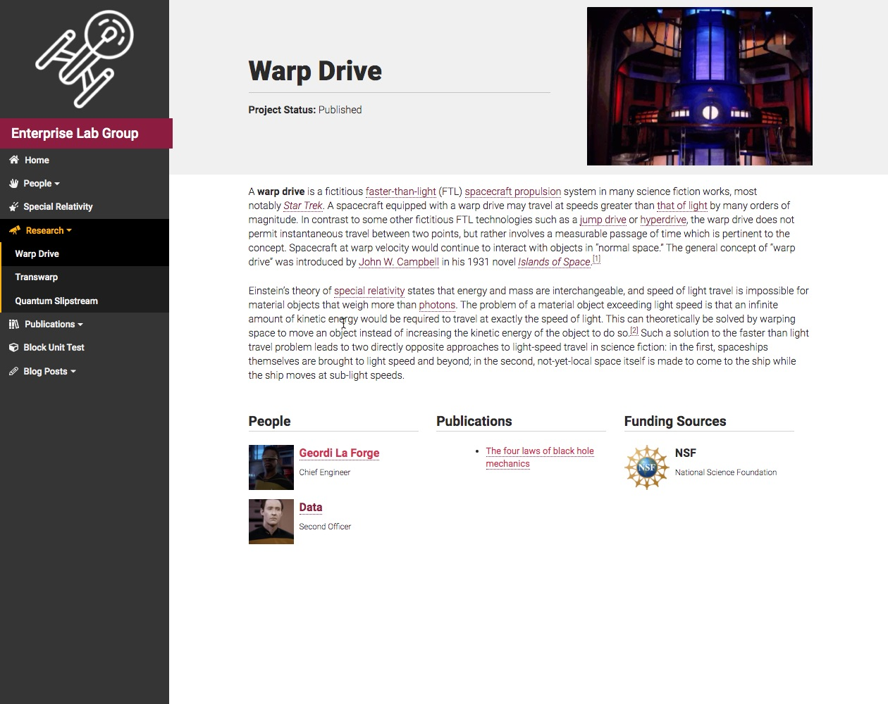
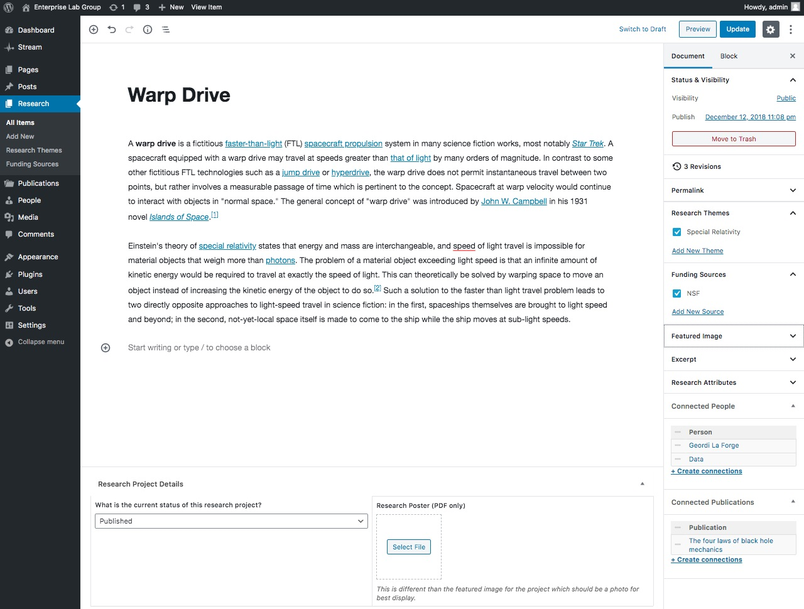

It is easy to quickly create a series of pages that focus on the active and completed research projects that are worked on by members of your lab.

## Screenshots ##

    
    

## Minimum Information Needed ##

Each research project should at a minimum contain a title and a 2-3 sentence description of the project. The project status also needs to be set via the dropdown box in the post meta area. (The default choice for a project is "active.")

## Completed Research Project ##

In addition to the basics described above, a fully completed research project tends to leverage the page editor's various content blocks to create a full description. The more intensional you are with content creation for these pages, the greater the chance that someone has of conducting an internet search for similar ideas. Consider including several sections in your description such as:

- the working hypothesis for the project
- a representation of the data collected
- links to proper data sets
- other research materials relevant to the discussion

Information about the project's funding or sponsorship can be included on the page by filling out the post details section below the main content window. These areas of the template were designed to be flexible and to accept custom HTML if needed.

Including a featured image for the project also will be helpful. Be sure that the chosen featured image doesn't include text captured within the image itself. (It'll be too small to see when the image is presented in other contexts on the site.) If you want to include an illustration within the project description, be sure to include a proper caption for the image.

## Organization ##

Research project pages can be categorized together under one unifying research topic. To accomplish this, be sure to assign the page to most appropriate  research topic category. Categories can be created "on the fly" within the post editor and can be edited in the [Research Topic](../research-topic.html) screen in the admin area.

(screenshot: taxonomy in edit sidebar)

## Technical Details ##

In addition to the page title and general description area, the following information can be added to each research project page.

Funding Source / Funding Company
: If the project was funded by an external source, you can highlight their contribution by including a link, an image or plain text within the **Funding Source** meta box below the main content editing space.

Use standard HTML markup to include items other than plain text in these areas.
For example, to include an image instead of text, include something like ``
{: .info}

Status
: By default, each research project is given a status of **Active** when the page is initially published.
: This information is found immediately under the title on the project page as well as within most other references to projects in other templates.
: Your research project can have one of five states: active, ongoing, completed, pending publication, or published

Research Poster (PDF Only)
: If your research project has an associated poster, you can upload and attach it to the project page. It will appear as an entry in the sidebar.
: This is useful if the project was presented at a conference, symposium or capstone presentation.

The WordPress default “archive” list of all research projects within a site has been disabled in this theme. Instead, please consider using the archive pages associated with a research theme as a way to list all projects (as well as all publications) associated with a specific topic. 
