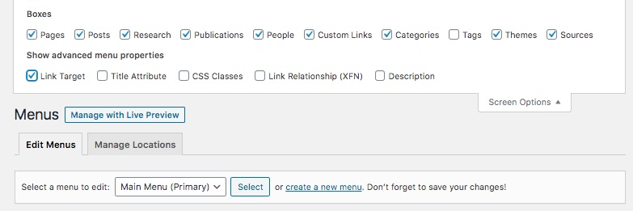
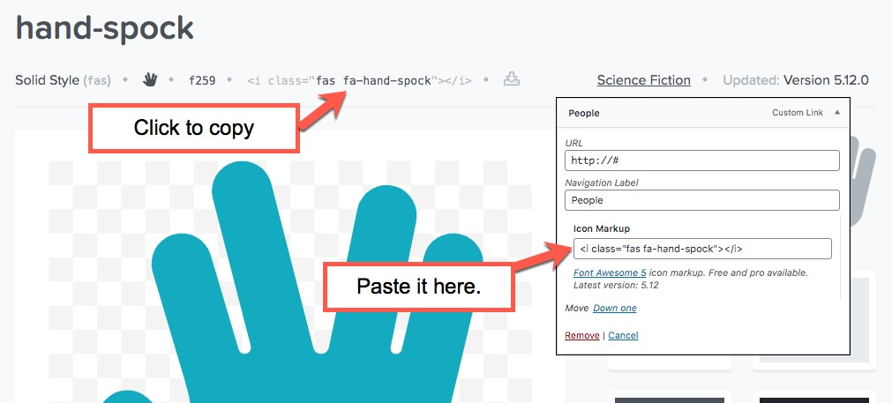

The sidebar of your website contains the site's branding information as well as the main menu for both desktop and mobile. It can be customized in multiple ways to best reflect the style of your lab and the content of your site.

### Where are my pages?

The most important thing to understand about the main menu of the site is that it will generally NOT automatically add new pages to the menu as you create them. This limitation is intensional - as your web site is populated with an increasing number of pages, the menu of the site has the potential to become overcrowded very quickly.

However, it is very easy to add any piece of content from within the site to the menu. It is generally a matter of selecting the right page or post from a list and maneuvering it into the order in which you'd like it displayed.

### Adding Items to a Menu

This theme for WordPress uses the built-in menu interface for editing and altering entries within the sidebar. Please reference the [WordPress Menu User Guide](https://codex.wordpress.org/WordPress_Menu_User_Guide) for the basic tasks needed to make changes to your site.

Be sure that the following content types within the Screen Options are enabled when altering the menu for the first time: **Pages, Posts, Research, Publications, People, Custom Links, Categories, Themes and Link Target.**

{: .resp}

### Adding a Custom Icon to a Navigation Item

This WordPress theme includes the entire collection of [icons from Font Awesome](https://fontawesome.com/icons). Adding one of these icons to an item in your menu is easy.

1. Look for the icon within the Font Awesome collection that you want to add to the menu item.
2. Click on the `<i class="fa fa-code"></i>` reference within the icon's page.
3. Paste the resulting code into the approroate box for the icon.

{: .resp}

For best results, try to only assign icons to top level menu items within your navigation. It makes the website easier to scan that way.  Try using [fa-user-circle](https://fontawesome.com/icons/user-circle?style=solid) for **people**, and [fa-books](https://fontawesome.com/icons/books?style=solid) for **publications**.
{: .info}
